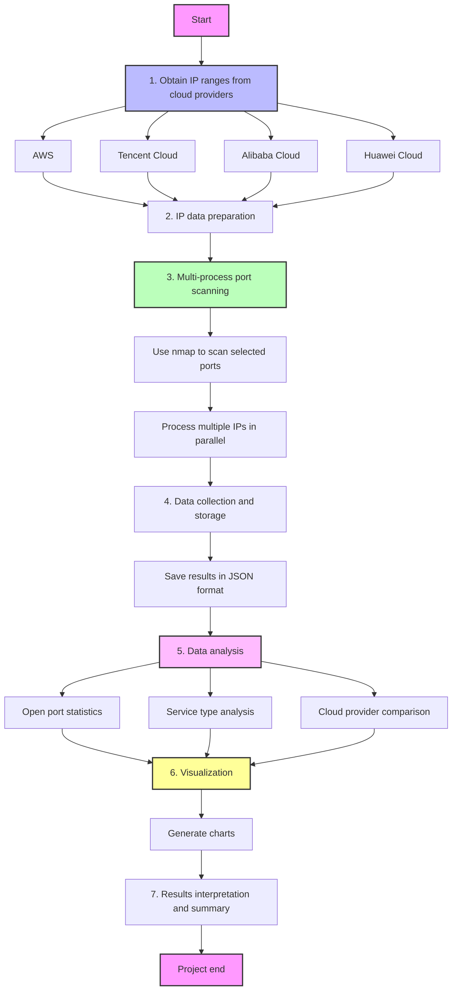

# ActiveProbing
## This project is for the active probing for a homework.





For this homework, we will use the active prob to analyze the 
the regular service and each port the ip address is using.
> For this part, let's leave alone the `IPV6` and only focus on the `IPV4`.


For vps server like :
- AWS
- Huawei Cloud
- Aliyun
- Tencent Cloud

# IP range for each of the vps provider

## 1. AWS
For aws, it is simple, because the ip range is public.

https://ip-ranges.amazonaws.com/ip-ranges.json


> PS: for the other three I use the (it is a paid web, so I can only
> part of the ips)
`https://networksdb.io/`
## 2. Tencent Cloud 

https://networksdb.io/ip-addresses-of/tencent-cloud-computing-beijing-co-ltd


## 3. Aliyun

https://networksdb.io/ip-addresses-of/tencent-cloud-computing-beijing-co-ltd


## 4. Huawei Cloud

https://networksdb.io/ip-addresses-of/huawei-cloud

# IPS


I have extracted the free part of the ips, you can check it 

| Cloud Service Provider | IP Count |
|------------------------|----------|
| Tencent Cloud          | 55,700   |
| Alibaba Cloud          | 38,937   |
| Amazon                 | 37,959   |
| Huawei Cloud           | 1,194    |

- aliyun [here](./resources/ipranges/aliyun_ips.jsonl)
- huawei cloud [here](./resources/ipranges/huawei_ips.jsonl)
- tencent cloud [here](./resources/ipranges/tencent_cloud_ips.jsonl)
- aws [here](./resources/ipranges/amazon_ips.jsonl)


# Installation

- PDM(recommended)
```bash
pip install pdm # if you have not installed pdm
pdm install
```

# Run scan
```bash
export PYTHONPATH=$PWD
pdm run python active_probing/main.py
```


# Format the code

```bash
bash format.sh
```


# To check the whole process 
please refer: 
- MD: [here](./整个流程介绍.md)
- PDF: [here](./whole_process.pdf)