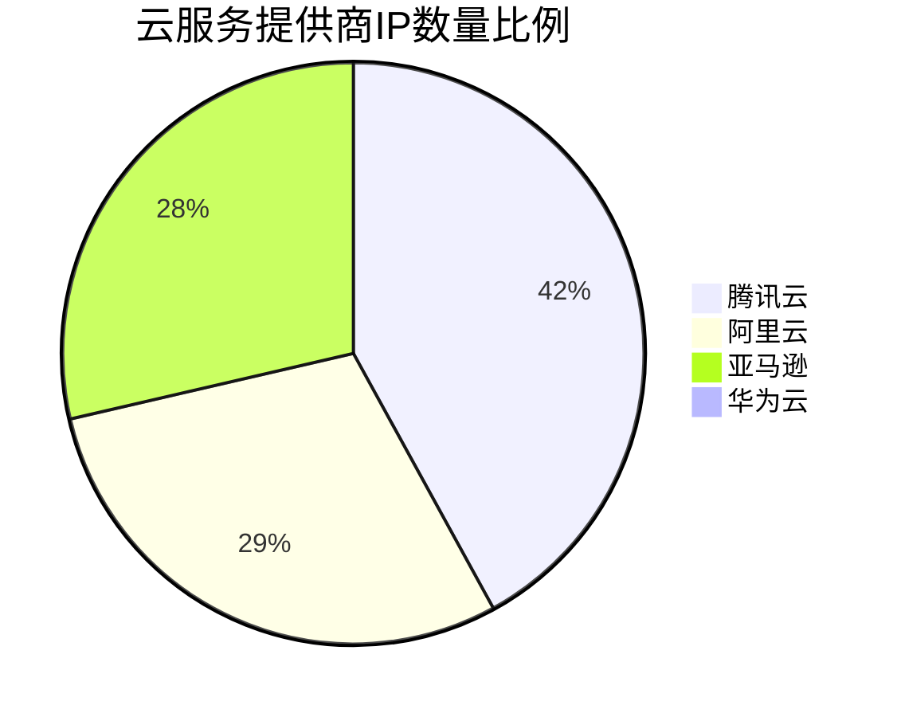

# 主动探测流程介绍


## 1.获取各大VPS厂商的IP范围

正如前面所说的， 我们已经获取了包含各个VPS服务器厂商的IP范围的网站：

## 1. AWS
For aws, it is simple, because the ip range is public.

https://ip-ranges.amazonaws.com/ip-ranges.json


> PS: for the other three I use the (it is a paid web, so I can only
> part of the ips)
> `https://networksdb.io/`
## 2. Tencent Cloud 

https://networksdb.io/ip-addresses-of/tencent-cloud-computing-beijing-co-ltd


## 3. Aliyun

https://networksdb.io/ip-addresses-of/tencent-cloud-computing-beijing-co-ltd


## 4. Huawei Cloud

https://networksdb.io/ip-addresses-of/huawei-cloud


除了第一个可以直接获取外， 后面的都需要编写爬虫来获取，爬虫代码在:

`src/activeprobing/utils/networksdb_scrapy_utils.py`

用于从NetworksDB网站提取各大云服务提供商的IP范围信息。该工具使用Python异步编程实现，能够高效地从多个URL抓取数据。

### 功能特点

- 支持从多个云服务提供商（腾讯云、阿里云、华为云）获取IP范围信息
- 使用异步HTTP请求提高抓取效率
- 解析HTML内容，提取结构化的IP范围数据
- 将抓取的数据保存为JSON格式，便于后续处理和分析

### 代码结构

主要的代码文件是 `src/activeprobing/utils/networksdb_scrapy_utils.py`，其中包含了 `SDBWebScraper` 类，该类负责执行网页抓取、数据解析和结果保存的全过程。

### 使用方法

1. 确保已安装所需的Python库：httpx, asyncio, selectolax, loguru
2. 运行 `networksdb_scrapy_utils.py` 脚本
3. 脚本将自动从预定义的URL列表中抓取数据
4. 抓取的数据将被保存在 `RESOURCES_JSONS_DIR_PATH` 目录下的JSON文件中

### 数据来源

- 腾讯云：https://networksdb.io/ip-addresses-of/tencent-cloud-computing-beijing-co-ltd
- 阿里云：https://networksdb.io/ip-addresses-of/tencent-cloud-computing-beijing-co-ltd
- 华为云：https://networksdb.io/ip-addresses-of/huawei-cloud

注意：AWS的IP范围可以直接从 https://ip-ranges.amazonaws.com/ip-ranges.json 获取，不需要使用此工具。

### 输出格式

每个云服务提供商的数据将被保存为单独的JSON文件，包含以下信息：
- 公司名称
- IP范围
- 网络相关信息
- 相关链接

### 最后得到的结果

```bash
2024-07-10 13:17:02.129 | INFO     | __main__:save_results:86 - 保存了 100 条记录到 C:\Users\23174\Desktop\GitHub Project\ActiveProbing\resources\jsons\tencent_cloud_ips.json
2024-07-10 13:17:02.131 | INFO     | __main__:save_results:86 - 保存了 61 条记录到 C:\Users\23174\Desktop\GitHub Project\ActiveProbing\resources\jsons\aliyun_ips.json
2024-07-10 13:17:02.133 | INFO     | __main__:save_results:86 - 保存了 74 条记录到 C:\Users\23174\Desktop\GitHub Project\ActiveProbing\resources\jsons\huawei_ips.json
```

> 也就是说我们一共获取得到了：
>
> - 100 条腾讯云的IP段落
> - 61 条阿里云的IP段落
> - 74条华为云的IP段落

其中一条数据的例子为:

```json
  {
        "company": "Aliyun Computing Co.LTDALIBABA_CLOUD",
        "CIDR": "43.0.0.0/10",
        "IP Range": "43.0.0.0 - 43.63.255.255",
        "Block size": "4,194,304",
        "links": [
            {
                "text": "All IPs in this network >>",
                "href": "https://networksdb.io/ips-in-network/43.0.0.0/43.63.255.255",
                "class": "link_sm"
            },
            {
                "text": "All domains in this network >>",
                "href": "https://networksdb.io/domains-in-network/43.0.0.0/43.63.255.255",
                "class": "link_sm"
            }
        ]
    }
```


至此，我们已经获取了各个云服务器厂商的IP段落， 为了帮助解析各个云服务器厂商的IP段落， 进行如下的IP的提取:

```python
from pydantic import BaseModel
class VpsIP(BaseModel):
    ip: str
    region: str
    service: str
```


其中解析得到的亚马逊的IP共有`125764529` 个，当然大部分可能是无效IP， 高达8.4G。


下面是其中部分的IP段信息:

```bash
{"ip": "34.251.29.16", "region": "eu-west-1", "service": "EC2"}
{"ip": "34.251.29.17", "region": "eu-west-1", "service": "EC2"}
{"ip": "34.251.29.18", "region": "eu-west-1", "service": "EC2"}
{"ip": "34.251.29.19", "region": "eu-west-1", "service": "EC2"}
{"ip": "34.251.29.20", "region": "eu-west-1", "service": "EC2"}
{"ip": "34.251.29.21", "region": "eu-west-1", "service": "EC2"}
{"ip": "34.251.29.22", "region": "eu-west-1", "service": "EC2"}
{"ip": "34.251.29.23", "region": "eu-west-1", "service": "EC2"}
{"ip": "34.251.29.24", "region": "eu-west-1", "service": "EC2"}
{"ip": "34.251.29.25", "region": "eu-west-1", "service": "EC2"}
{"ip": "34.251.29.26", "region": "eu-west-1", "service": "EC2"}
{"ip": "34.251.29.27", "region": "eu-west-1", "service": "EC2"}
```

由于里面的IP过多， 所以只是随机挑选一些进行扫描测试。

这里我们随机挑选每个IP段落5个IP，然后一共得到`37959`个亚马逊的IP。


- 对于来自SDB的腾讯云，阿里云，和华为云的IP， 里面有一个页面显示了该IP段下进行了DNS解析的IP， 相比没有解析的IP， 解析了DNS域名的IP明显更具有价值， 所以这里我们选取每个IP段落下解析了DNS的IP进行筛选：

  > 比如说其中IP为: `**47.104.8.247:**` : yunxiaotc.com
  >
  > 就是解析到了一共医院的网页:
  >
  > 


但是和之前一样，整个域名列表需要花钱，所以我们只取免费部分即可， 这部分已经够多了


但是这个网页对爬虫的请求速率限制：


所以这里采用代理池(`基于round robin的分流策略`)的方法进行请求即可。

下面是提取到的部分IP：


最后提取到的IP数量如下:

- 阿里云: 38937
- 亚马逊:  37959
- 华为云： 1194
- 腾讯云： 55700



- 腾讯云拥有最大的份额，约占总数的41.7%
- 阿里云和亚马逊AWS的份额相当，分别约占29.2%和28.4%
- 华为云的份额最小，仅占约0.9%

> 课件华为云在这个市场深耕较少，令人意外的是， 阿里云的VPS的IPS数量居然不是中国最多的， 当然也可能是大多数数据都是要付费购买，非付费购买的数据也就这样了。