# 主动探测流程介绍


> 项目连接：[linkedlist771/ActiveProbing: This project is for the active probing for a homework. (github.com)](https://github.com/linkedlist771/ActiveProbing)


## 1.获取各大VPS厂商的IP范围

正如前面所说的， 我们已经获取了包含各个VPS服务器厂商的IP范围的网站：

## 1. AWS
For aws, it is simple, because the ip range is public.

https://ip-ranges.amazonaws.com/ip-ranges.json


> PS: for the other three I use the (it is a paid web, so I can only
> part of the ips)
> `https://networksdb.io/`
## 2. Tencent Cloud 

https://networksdb.io/ip-addresses-of/tencent-cloud-computing-beijing-co-ltd


## 3. Aliyun

https://networksdb.io/ip-addresses-of/tencent-cloud-computing-beijing-co-ltd


## 4. Huawei Cloud

https://networksdb.io/ip-addresses-of/huawei-cloud


除了第一个可以直接获取外， 后面的都需要编写爬虫来获取，爬虫代码在:

`src/activeprobing/utils/networksdb_scrapy_utils.py`

用于从NetworksDB网站提取各大云服务提供商的IP范围信息。该工具使用Python异步编程实现，能够高效地从多个URL抓取数据。

### 功能特点

- 支持从多个云服务提供商（腾讯云、阿里云、华为云）获取IP范围信息
- 使用异步HTTP请求提高抓取效率
- 解析HTML内容，提取结构化的IP范围数据
- 将抓取的数据保存为JSON格式，便于后续处理和分析

### 代码结构

主要的代码文件是 `src/activeprobing/utils/networksdb_scrapy_utils.py`，其中包含了 `SDBWebScraper` 类，该类负责执行网页抓取、数据解析和结果保存的全过程。

### 使用方法

1. 确保已安装所需的Python库：httpx, asyncio, selectolax, loguru
2. 运行 `networksdb_scrapy_utils.py` 脚本
3. 脚本将自动从预定义的URL列表中抓取数据
4. 抓取的数据将被保存在 `RESOURCES_JSONS_DIR_PATH` 目录下的JSON文件中

### 数据来源

- 腾讯云：https://networksdb.io/ip-addresses-of/tencent-cloud-computing-beijing-co-ltd
- 阿里云：https://networksdb.io/ip-addresses-of/tencent-cloud-computing-beijing-co-ltd
- 华为云：https://networksdb.io/ip-addresses-of/huawei-cloud

注意：AWS的IP范围可以直接从 https://ip-ranges.amazonaws.com/ip-ranges.json 获取，不需要使用此工具。

### 输出格式

每个云服务提供商的数据将被保存为单独的JSON文件，包含以下信息：
- 公司名称
- IP范围
- 网络相关信息
- 相关链接

### 最后得到的结果

```bash
2024-07-10 13:17:02.129 | INFO     | __main__:save_results:86 - 保存了 100 条记录到 C:\Users\23174\Desktop\GitHub Project\ActiveProbing\resources\jsons\tencent_cloud_ips.json
2024-07-10 13:17:02.131 | INFO     | __main__:save_results:86 - 保存了 61 条记录到 C:\Users\23174\Desktop\GitHub Project\ActiveProbing\resources\jsons\aliyun_ips.json
2024-07-10 13:17:02.133 | INFO     | __main__:save_results:86 - 保存了 74 条记录到 C:\Users\23174\Desktop\GitHub Project\ActiveProbing\resources\jsons\huawei_ips.json
```

> 也就是说我们一共获取得到了：
>
> - 100 条腾讯云的IP段落
> - 61 条阿里云的IP段落
> - 74条华为云的IP段落

其中一条数据的例子为:

```json
  {
        "company": "Aliyun Computing Co.LTDALIBABA_CLOUD",
        "CIDR": "43.0.0.0/10",
        "IP Range": "43.0.0.0 - 43.63.255.255",
        "Block size": "4,194,304",
        "links": [
            {
                "text": "All IPs in this network >>",
                "href": "https://networksdb.io/ips-in-network/43.0.0.0/43.63.255.255",
                "class": "link_sm"
            },
            {
                "text": "All domains in this network >>",
                "href": "https://networksdb.io/domains-in-network/43.0.0.0/43.63.255.255",
                "class": "link_sm"
            }
        ]
    }
```


至此，我们已经获取了各个云服务器厂商的IP段落， 为了帮助解析各个云服务器厂商的IP段落， 进行如下的IP的提取:

```python
from pydantic import BaseModel
class VpsIP(BaseModel):
    ip: str
    region: str
    service: str
```


其中解析得到的亚马逊的IP共有`125764529` 个，当然大部分可能是无效IP， 高达8.4G。


下面是其中部分的IP段信息:

```bash
{"ip": "34.251.29.16", "region": "eu-west-1", "service": "EC2"}
{"ip": "34.251.29.17", "region": "eu-west-1", "service": "EC2"}
{"ip": "34.251.29.18", "region": "eu-west-1", "service": "EC2"}
{"ip": "34.251.29.19", "region": "eu-west-1", "service": "EC2"}
{"ip": "34.251.29.20", "region": "eu-west-1", "service": "EC2"}
{"ip": "34.251.29.21", "region": "eu-west-1", "service": "EC2"}
{"ip": "34.251.29.22", "region": "eu-west-1", "service": "EC2"}
{"ip": "34.251.29.23", "region": "eu-west-1", "service": "EC2"}
{"ip": "34.251.29.24", "region": "eu-west-1", "service": "EC2"}
{"ip": "34.251.29.25", "region": "eu-west-1", "service": "EC2"}
{"ip": "34.251.29.26", "region": "eu-west-1", "service": "EC2"}
{"ip": "34.251.29.27", "region": "eu-west-1", "service": "EC2"}
```

由于里面的IP过多， 所以只是随机挑选一些进行扫描测试。

这里我们随机挑选每个IP段落5个IP，然后一共得到`37959`个亚马逊的IP。


- 对于来自SDB的腾讯云，阿里云，和华为云的IP， 里面有一个页面显示了该IP段下进行了DNS解析的IP， 相比没有解析的IP， 解析了DNS域名的IP明显更具有价值， 所以这里我们选取每个IP段落下解析了DNS的IP进行筛选：

  > 比如说其中IP为: `**47.104.8.247:**` : yunxiaotc.com
  >
  > 就是解析到了一共医院的网页:
  >
  > 

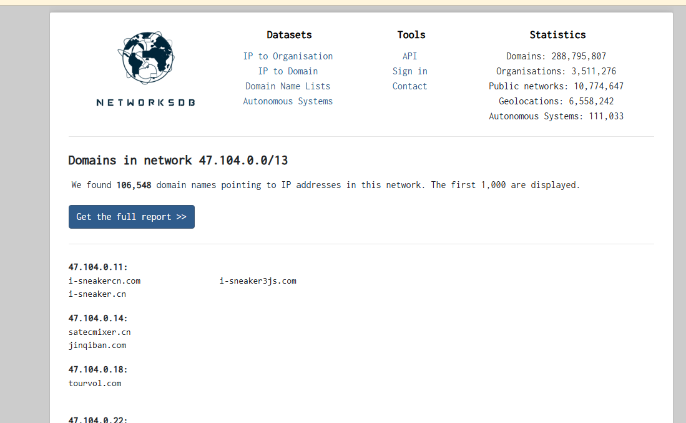

但是和之前一样，整个域名列表需要花钱，所以我们只取免费部分即可， 这部分已经够多了


但是这个网页对爬虫的请求速率限制：

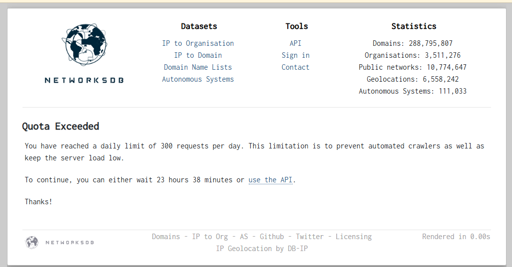

所以这里采用代理池(`基于round robin的分流策略`)的方法进行请求即可。

下面是提取到的部分IP：

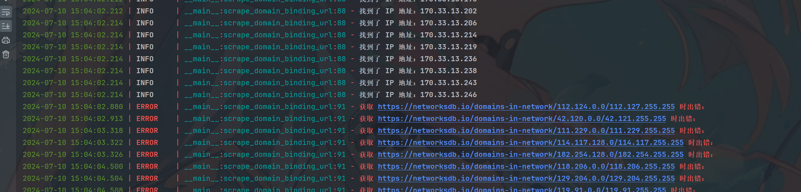

最后提取到的IP数量如下:

- 阿里云: 38937
- 亚马逊:  37959
- 华为云： 1194
- 腾讯云： 55700

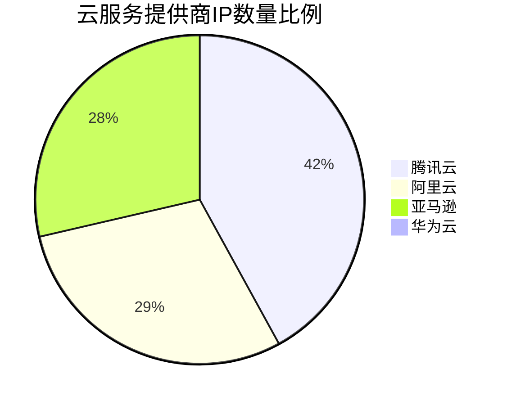

- 腾讯云拥有最大的份额，约占总数的41.7%
- 阿里云和亚马逊AWS的份额相当，分别约占29.2%和28.4%
- 华为云的份额最小，仅占约0.9%

> 课件华为云在这个市场深耕较少，令人意外的是， 阿里云的VPS的IPS数量居然不是中国最多的， 当然也可能是大多数数据都是要付费购买，非付费购买的数据也就这样了。


下面从这些IP中每个都随机抽取100个ip利用`ipinfo.io`来查看其地理位置进行可视化显示:

- 华为

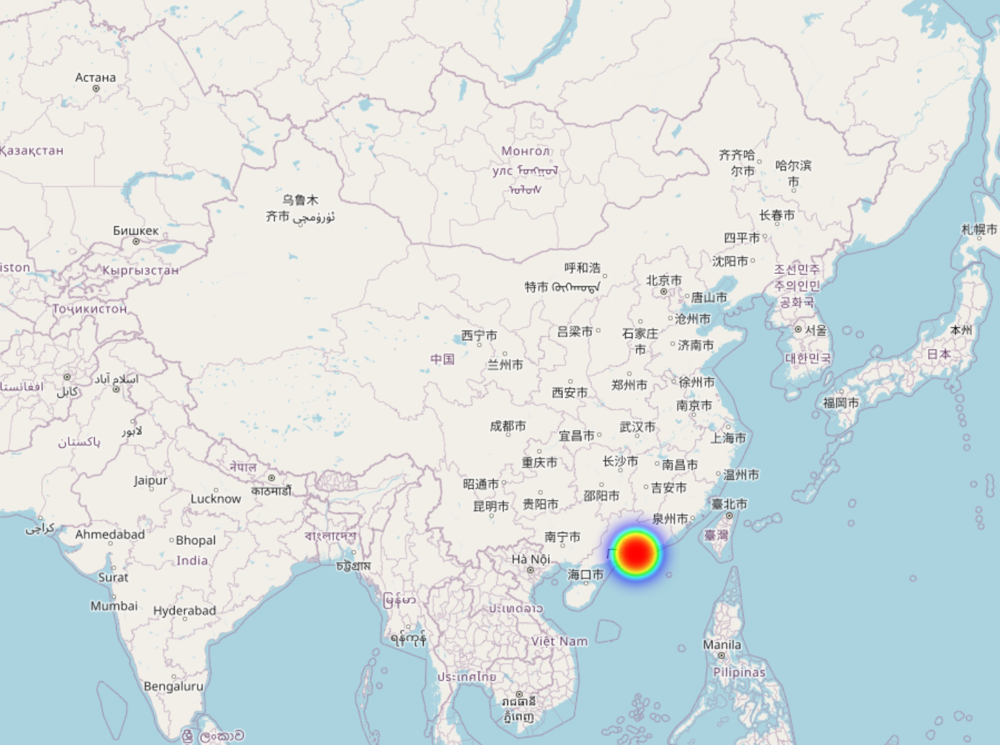

- 阿里云

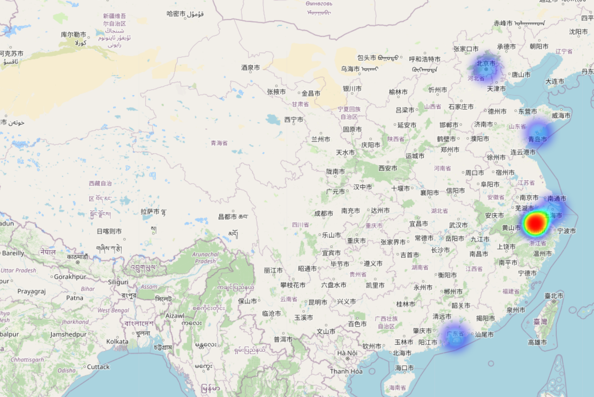

- 腾讯云

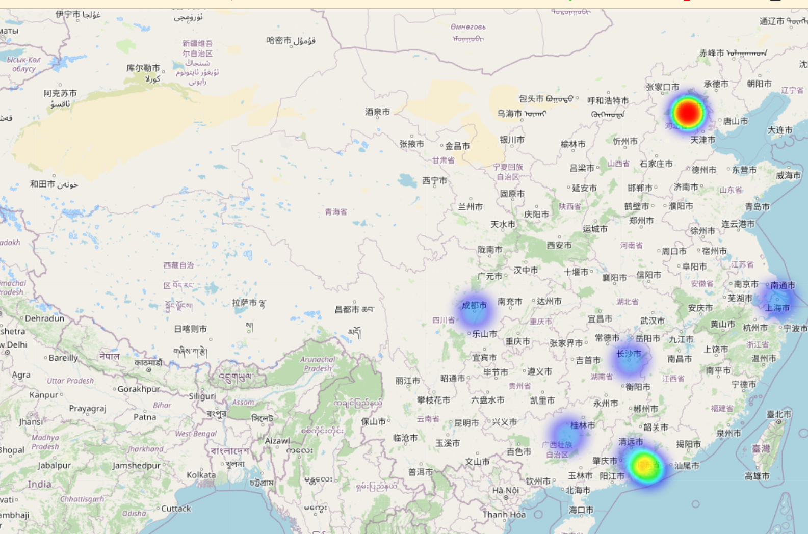

- 亚马逊

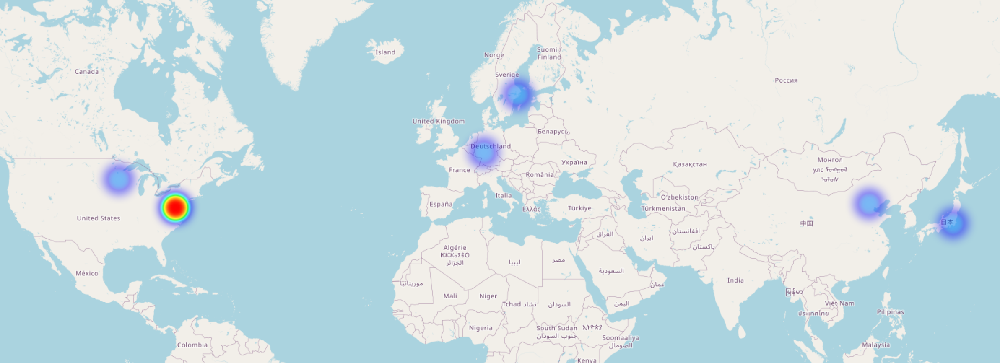

> 从上面VPS的IP分布可以看出， 华为云由于VPS的IP较少，抽样部分只分布在`香港`这个地方， 阿里的主要分布在`北京，杭州`等地，因为阿里的base也在这里，也挺符合阿里的公司的性质， 同理腾讯云主要分布在`深圳和北京`也符合腾讯的base的分布， 而亚马逊作为一个国际化的公司，在全球各地都有IP分布，其中`美国华盛顿`分布最多， 在其他地方类似北京，日本，瑞士等地也有分布， 也符合其国际化公司的特点。 那么根据IP位置和公司性质分析，我们所取样的IP是具有实际意义的IP。


## 2. IP主动探测

在`第一步`中，我们已经获取了关于各大VPS厂商中， 具有实际意义的代表的部分VPS的IP， 下一步我们将进行主动探测 ， 主要探测在该IP上主要启动了哪些服务,  这里我们不进行全量端口的扫描，这样太耗时， 借助于`claud3.5`的帮助， 我们决定选取下面的常见服务进行端口扫描：

| 端口      | 可能的服务                         |
| --------- | ---------------------------------- |
| 20        | FTP-DATA (文件传输协议数据)        |
| 21        | FTP (文件传输协议)                 |
| 22        | SSH (安全外壳协议)                 |
| 23        | Telnet (远程登录协议)              |
| 25        | SMTP (简单邮件传输协议)            |
| 53        | DNS (域名系统)                     |
| 80        | HTTP (超文本传输协议)              |
| 110       | POP3 (邮局协议版本3)               |
| 123       | NTP (网络时间协议)                 |
| 143       | IMAP (互联网消息访问协议)          |
| 161       | SNMP (简单网络管理协议)            |
| 389       | LDAP (轻型目录访问协议)            |
| 443       | HTTPS (超文本传输安全协议)         |
| 445       | SMB (服务器消息块)                 |
| 587       | SMTP Submission (邮件提交)         |
| 636       | LDAPS (安全轻型目录访问协议)       |
| 989-990   | FTPS (安全文件传输协议)            |
| 993       | IMAPS (安全IMAP)                   |
| 995       | POP3S (安全POP3)                   |
| 1433      | Microsoft SQL Server               |
| 1521      | Oracle Database                    |
| 1830      | Oracle Database                    |
| 1883      | MQTT (消息队列遥测传输)            |
| 2049      | NFS (网络文件系统)                 |
| 3306      | MySQL Database                     |
| 3389      | RDP (远程桌面协议)                 |
| 3690      | SVN (Subversion版本控制)           |
| 5353      | mDNS (多播DNS)                     |
| 5432-5433 | PostgreSQL Database                |
| 5672      | AMQP (高级消息队列协议)            |
| 5900-5905 | VNC (虚拟网络计算)                 |
| 6379      | Redis (远程字典服务器)             |
| 8000      | 常用于Web服务器或代理              |
| 8080      | 常用于Web服务器或代理              |
| 8443      | 常用于HTTPS的备用端口              |
| 9000      | 常用于Web服务器或应用服务器        |
| 9200      | Elasticsearch                      |
| 9418      | Git (版本控制系统)                 |
| 11211     | Memcached (分布式内存对象缓存系统) |
| 22222     | 常用于SSH的备用端口                |
| 27017     | MongoDB                            |
| 61613     | STOMP (简单文本导向消息协议)       |


其中进行扫描所使用的软件为`nmap` ，扫描的命令为:

```bash
["nmap", "-p", NORMAL_SERVICE_PORTS, "-T4", self.ip],
```

>  也就是指定端口号和ip进行`-T4`级别的快速扫描。

### 代码实现

- UML图


- 时序图

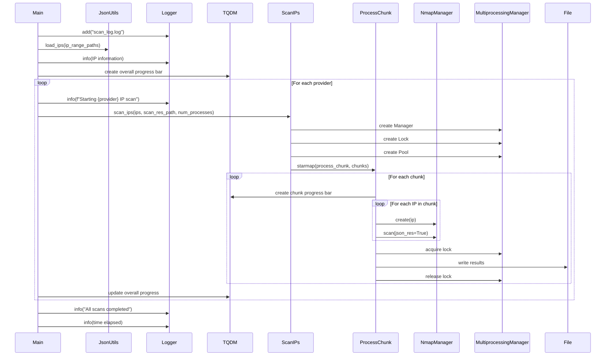

- **IP数据准备**

首先，我们从JSON文件中加载各云服务提供商的IP地址：

```python
aliyun_ips = load_ips(aliyun_ips_range_path)[:idx]
huawei_ips = load_ips(huawei_ips_range_path)[:idx]
amazon_ips = load_ips(amazon_ips_range_path)[:idx]
tencent_cloud_ips = load_ips(tencent_cloud_ips_save_path)[:idx]
```

- **多进程扫描**

为了提高扫描效率，我们使用Python的`multiprocessing`模块实现并行扫描：

```python
def scan_ips(ips: list[Dict[str, str]], output_file: str, num_processes: int = 4):
    chunk_size = max(len(ips) // num_processes, 1)
    chunks = [ips[i : i + chunk_size] for i in range(0, len(ips), chunk_size)]

    with Manager() as manager:
        lock = manager.Lock()
        with Pool(processes=num_processes) as pool:
            pool.starmap(
                process_chunk, [(chunk, output_file, lock) for chunk in chunks]
            )
```

- **单个IP扫描**

对于每个IP，我们使用`NmapManager`类来执行nmap扫描：

```python
def process_chunk(chunk: list[Dict[str, str]], output_file: str, lock: Lock):
    results = []
    for ip in tqdm(chunk, desc="Processing chunk"):
        nmap_manager = NmapManger(ip)
        res = nmap_manager.scan(json_res=True)
        results.append(res)
    
    # 保存结果
    with lock:
        with open(output_file, "a") as f:
            for ip_data in results:
                f.write(json.dumps(ip_data) + "\n")
```

- **结果保存**

扫描结果以JSON格式保存到指定的输出文件。我们使用文件锁来确保多进程写入的安全性。

- **进度监控和日志记录**

我们使用`tqdm`库来显示扫描进度，使用`loguru`库记录详细的扫描信息：

```python
with tqdm(total=len(providers), desc="Overall scanning progress") as pbar:
    for provider, ips, scan_res_path in providers:
        logger.info(f"Starting {provider} IP scan")
        scan_ips(ips, scan_res_path, num_processes=cpu_count())
        pbar.update(1)
        pbar.set_description(f"Completed {provider} scan")
```

- **主函数流程**

在主函数中，我们依次对各个云服务提供商的IP进行扫描：

```python
def main():
    # 加载IP
    # ...

    providers = [
        ("Aliyun", aliyun_ips, aliyun_scan_res_path),
        ("Huawei", huawei_ips, huawei_scan_res_path),
        ("Amazon", amazon_ips, amazon_scan_res_path),
        ("Tencent Cloud", tencent_cloud_ips, tencent_cloud_scan_res_path),
    ]

    # 执行扫描
    # ...

    logger.info("All scans completed")
    time_elapsed = time.time() - start_time
    logger.info(f"Time elapsed: {time_elapsed:.2f} seconds")
```


## 3. 主动探测结果与分析

> 此次扫描主要使用nmap对四大主要VPS厂商进行了扫描分析。
>
> - 总共耗时： 大概20个小时

- 华为云

这里对于不同的端口的扫， 其中防火墙开启的端口要么出于开启要么处于关闭的状态，这里只分析这些被扫描到的端口， 对于扫描失败的端口就不分析了。

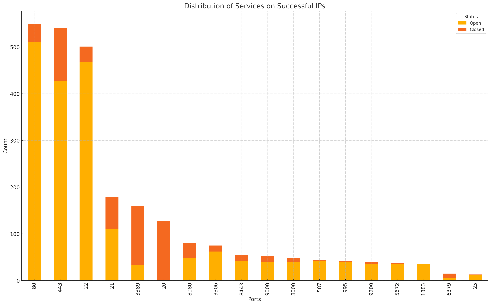

> 根据对华为云VPS端口扫描结果的数据分析，以下是主要的发现和总结：
>
> ### 数据概览
> - **总共扫描的IP地址**：695个
> - **成功扫描的IP地址**：421个
>
> ### 主要端口服务分布
> 在成功扫描的421个IP中，不同端口的服务分布情况如下：
>
> - **开放（Open）**
>   - 80端口（HTTP）：643个
>   - 8080端口（HTTP-Alt）：81个
>   - 21端口（FTP）：63个
>   - 22端口（SSH）：34个
>   - 25端口（SMTP）：2个
>   - 443端口（HTTPS）：26个
>   - 3306端口（MySQL）：10个
>
> - **关闭（Closed）**
>   - 80端口（HTTP）：40个
>   - 21端口（FTP）：69个
>   - 22端口（SSH）：34个
>   - 25端口（SMTP）：2个
>
> ### 图表解读
> - **80端口（HTTP）**是最常见的开放端口，有643个IP开放此端口，同时有40个IP关闭。
> - **21端口（FTP）**和**22端口（SSH）**也是较为常见的服务，其中21端口有63个开放，69个关闭；22端口有34个开放，34个关闭。
> - **8080端口（HTTP-Alt）**有81个开放，没有记录关闭的数据。
>
> ### 结论
> - 绝大多数成功扫描的IP都开放了80端口，用于HTTP服务，这符合预期，因为这是一个常见的Web服务端口。
> - FTP和SSH也是常见的服务，尤其是FTP服务，既有较多的开放端口也有较多的关闭端口。
> - 部分较为专业的服务端口如3306端口（MySQL）在少数IP上开放，反映出某些IP可能用于数据库服务。
>


- 阿里云

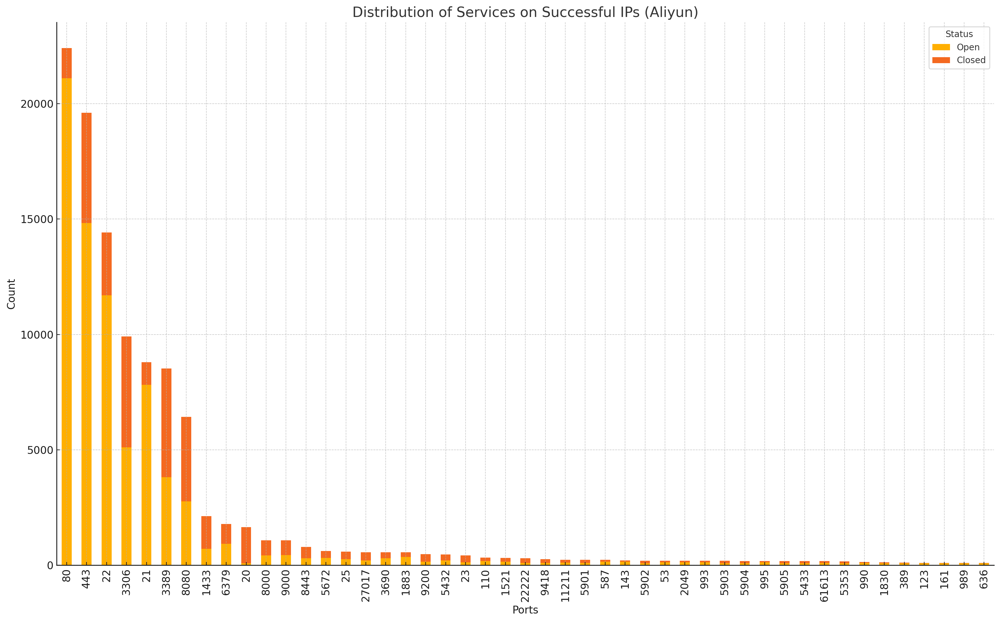

> ### 数据概览
>
> - **总共扫描的IP地址**：22,768个
> - **成功扫描的IP地址**：15,539个
>
> ### 主要端口服务分布
>
> 在成功扫描的15,539个IP中，不同端口的服务分布情况如下：
>
> - **开放（Open）**
>   - 80端口（HTTP）：21,110个
>   - 443端口（HTTPS）：14,822个
>   - 22端口（SSH）：11,699个
>   - 3306端口（MySQL）：5,114个
>   - 21端口（FTP）：7,819个
>   - 3389端口（RDP）：3,811个
>   - 8080端口（HTTP-Alt）：2,763个
>
> - **关闭（Closed）**
>   - 80端口（HTTP）：1,301个
>   - 443端口（HTTPS）：4,782个
>   - 22端口（SSH）：2,718个
>   - 3306端口（MySQL）：4,802个
>   - 21端口（FTP）：974个
>   - 3389端口（RDP）：4,710个
>   - 8080端口（HTTP-Alt）：3,662个
>
> ### 图表解读
>
> 图表展示了成功扫描的IP中主要端口服务的分布情况。图中使用堆叠柱状图表示每个端口的开放和关闭状态的数量。
>
> - **80端口（HTTP）**是最常见的开放端口，有21,110个IP开放此端口，同时有1,301个IP关闭。
> - **443端口（HTTPS）**是第二常见的开放端口，有14,822个IP开放，同时有4,782个IP关闭。
> - **22端口（SSH）**也较为常见，有11,699个IP开放，同时有2,718个IP关闭。
>
> ### 结论
>
> - 绝大多数成功扫描的IP都开放了80端口和443端口，用于HTTP和HTTPS服务，这符合预期，因为这些是常见的Web服务端口。
> - SSH和FTP也是常见的服务，SSH服务端口有较多的开放和关闭情况。
> - 数据库服务端口如3306端口（MySQL）在少数IP上开放，但也有大量IP关闭此端口，反映出其使用情况的多样性。


- 亚马逊

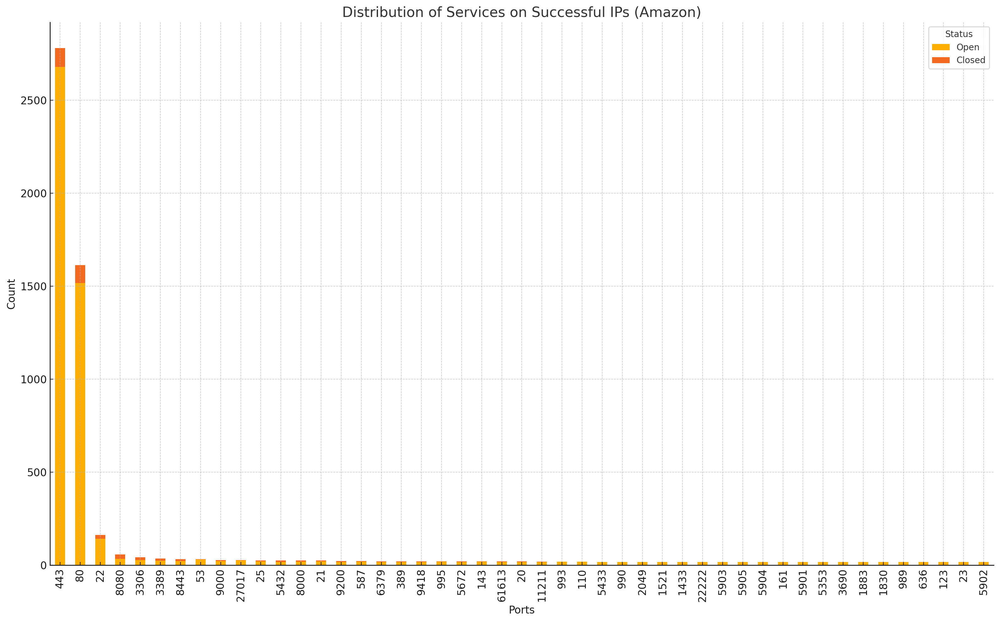

> ### 数据概览
>
> - **总共扫描的IP地址**：37,777个
> - **成功扫描的IP地址**：3,834个
>
> ### 主要端口服务分布
>
> 在成功扫描的3,834个IP中，不同端口的服务分布情况如下：
>
> - **开放（Open）**
>   - 443端口（HTTPS）：2,679个
>   - 80端口（HTTP）：1,517个
>   - 22端口（SSH）：143个
>   - 8080端口（HTTP-Alt）：34个
>   - 3306端口（MySQL）：27个
>   - 3389端口（RDP）：24个
>
> - **关闭（Closed）**
>   - 443端口（HTTPS）：101个
>   - 80端口（HTTP）：96个
>   - 22端口（SSH）：19个
>   - 8080端口（HTTP-Alt）：24个
>   - 3306端口（MySQL）：15个
>   - 3389端口（RDP）：12个
>
> ### 图表解读
>
> 图表展示了成功扫描的IP中主要端口服务的分布情况。图中使用堆叠柱状图表示每个端口的开放和关闭状态的数量。
>
> - **443端口（HTTPS）**是最常见的开放端口，有2,679个IP开放此端口，同时有101个IP关闭。
> - **80端口（HTTP）**是第二常见的开放端口，有1,517个IP开放，同时有96个IP关闭。
> - **22端口（SSH）**也较为常见，有143个IP开放，同时有19个IP关闭。
>
> ### 结论
>
> - 绝大多数成功扫描的IP都开放了443端口和80端口，用于HTTPS和HTTP服务，这符合预期，因为这些是常见的Web服务端口。
> - SSH服务也较为常见，但开放的数量相对较少。
> - 其他服务如MySQL和RDP等在少数IP上开放，反映出其使用情况的多样性。
>

- 腾讯云

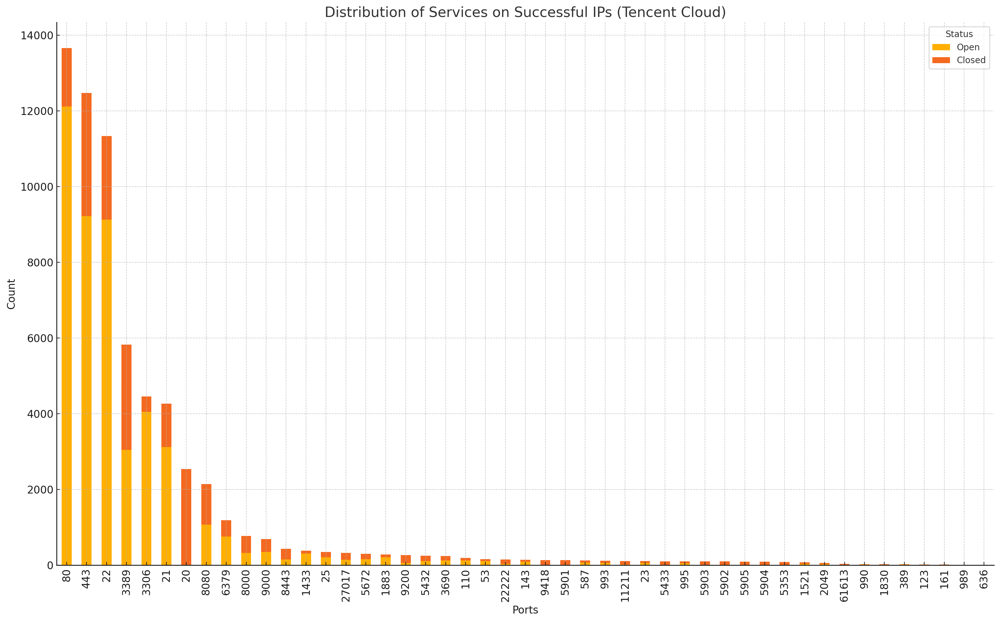


> ### 数据概览
> - 总共扫描的IP地址：14843个
> - 成功扫描的IP地址：9097个
>
> ### 主要端口服务分布
> 在成功扫描的9097个IP中，不同端口的服务分布情况如下：
>
> #### 开放（Open）
> - **80端口（HTTP）**：12118个
> - **443端口（HTTPS）**：9218个
> - **22端口（SSH）**：9131个
> - **3389端口（RDP）**：3046个
> - **3306端口（MySQL）**：4051个
> - **21端口（FTP）**：3120个
> - **8080端口（HTTP-Alt）**：1074个
>
> #### 关闭（Closed）
> - **80端口（HTTP）**：1540个
> - **443端口（HTTPS）**：3257个
> - **22端口（SSH）**：2202个
> - **3389端口（RDP）**：2777个
> - **3306端口（MySQL）**：405个
> - **21端口（FTP）**：1146个
> - **8080端口（HTTP-Alt）**：1068个
>
> ### 图表解读
> 图表展示了成功扫描的IP中主要端口服务的分布情况。图中使用堆叠柱状图表示每个端口的开放和关闭状态的数量。
>
> - **80端口（HTTP）** 是最常见的开放端口，有12118个IP开放此端口，同时有1540个IP关闭。
> - **443端口（HTTPS）** 是第二常见的开放端口，有9218个IP开放，同时有3257个IP关闭。
> - **22端口（SSH）** 也较为常见，有9131个IP开放，同时有2202个IP关闭。
>
> ### 结论
> 绝大多数成功扫描的IP都开放了80端口和443端口，用于HTTP和HTTPS服务，这符合预期，因为这些是常见的Web服务端口。SSH服务也较为常见，但开放的数量相对较少。其他服务如RDP和MySQL等在少数IP上开放，反映出其使用情况的多样性。
>


- 总结


> 
>
> ```mermaid
> graph TD
>     subgraph 云服务商端口开放比较
>     A[华为云] --> |80端口| A1[92.5%]
>     A --> |443端口| A2[3.7%]
>     A --> |22端口| A3[4.9%]
> 
>     B[阿里云] --> |80端口| B1[92.7%]
>     B --> |443端口| B2[65.1%]
>     B --> |22端口| B3[51.4%]
> 
>     C[亚马逊云] --> |80端口| C1[39.6%]
>     C --> |443端口| C2[69.9%]
>     C --> |22端口| C3[3.7%]
> 
>     D[腾讯云] --> |80端口| D1[81.6%]
>     D --> |443端口| D2[62.1%]
>     D --> |22端口| D3[61.5%]
> 
>     style A fill:#f9f,stroke:#333,stroke-width:2px
>     style B fill:#bbf,stroke:#333,stroke-width:2px
>     style C fill:#fbb,stroke:#333,stroke-width:2px
>     style D fill:#bfb,stroke:#333,stroke-width:2px
>     end
> ```
>
>  基于对华为云、阿里云、亚马逊云和腾讯云这四大云服务商的端口扫描结果，我们可以得出以下总结和对比：
>
> 1. 扫描规模和成功率：
>    - 亚马逊云扫描的IP数量最多（37,777个），但成功率最低（约10%）。
>    - 阿里云扫描的IP数量次之（22,768个），成功率较高（约68%）。
>    - 腾讯云扫描的IP数量为14,843个，成功率较高（约61%）。
>    - 华为云扫描的IP数量最少（695个），但成功率最高（约61%）。
>
> 2. 常见开放端口：
>    - 所有云服务商都以80端口（HTTP）和443端口（HTTPS）为最常见的开放端口，这反映了Web服务在云计算中的普遍性。
>    - 22端口（SSH）在所有云服务商中也普遍开放，但开放比例各不相同。
>
> 3. 特定服务比较：
>    - HTTP（80端口）：阿里云开放比例最高，其次是腾讯云和华为云，亚马逊云相对较低。
>    - HTTPS（443端口）：亚马逊云开放比例最高，其他云服务商也有较高比例。
>    - SSH（22端口）：腾讯云和阿里云开放比例较高，华为云和亚马逊云相对较低。
>    - 数据库服务（3306端口）：阿里云和腾讯云开放比例较高，华为云和亚马逊云较低。
>
> 4. 安全性考虑：
>    - 亚马逊云似乎对端口访问有较严格的控制，这可能反映了其更注重安全性。
>    - 阿里云和腾讯云在多种服务端口上都有较高的开放率，这可能提供了更多的服务选择，但也可能增加了潜在的安全风险。
>
> 5. 服务多样性：
>    - 阿里云和腾讯云显示出更多样化的服务端口开放情况，包括FTP、RDP等。
>    - 华为云和亚马逊云的服务端口开放情况相对集中在几个主要端口上。
>
> 6. 个性化特征：
>    - 华为云在8080端口（HTTP-Alt）上有较高的开放率。
>    - 阿里云在21端口（FTP）上有明显的开放倾向。
>    - 亚马逊云在443端口（HTTPS）上的开放比例特别高，远超其他端口。
>    - 腾讯云在各主要端口上都有较为均衡的开放情况。
>


## 4. 总结

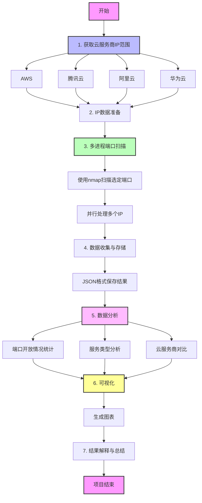

