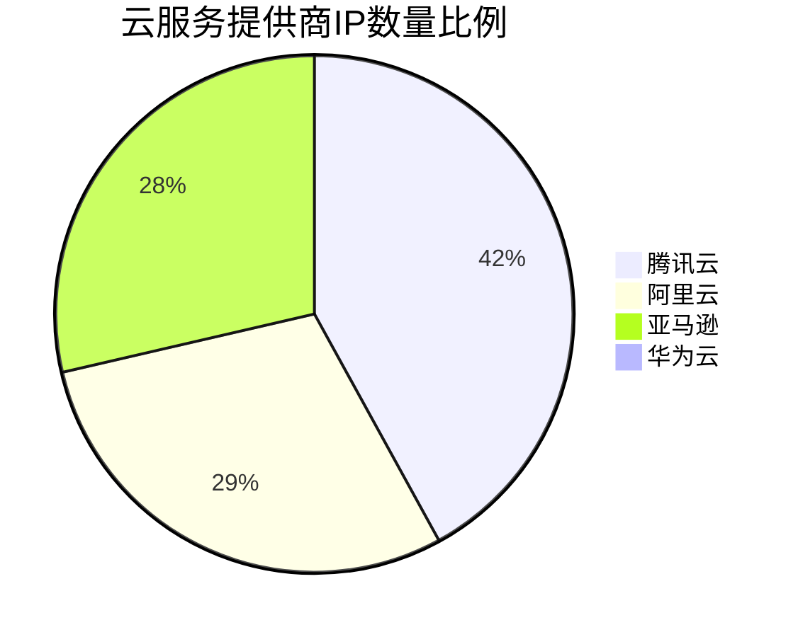
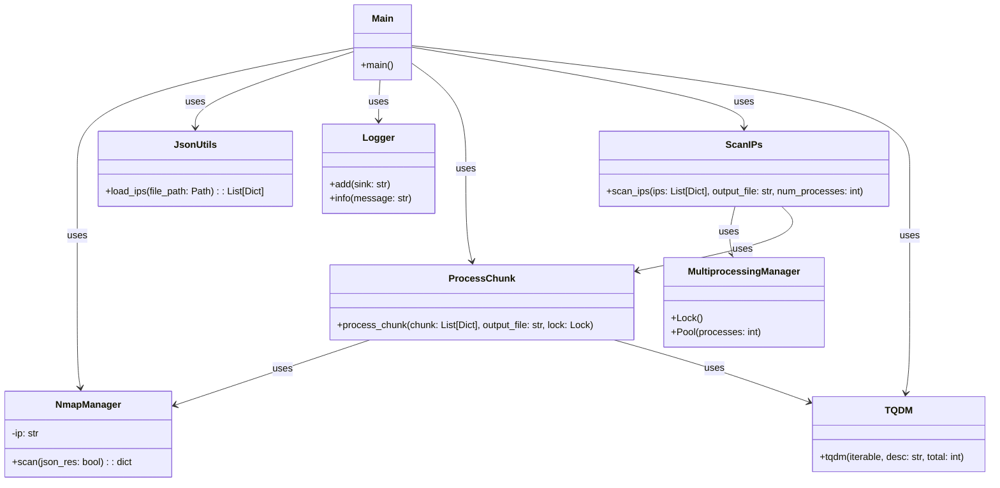
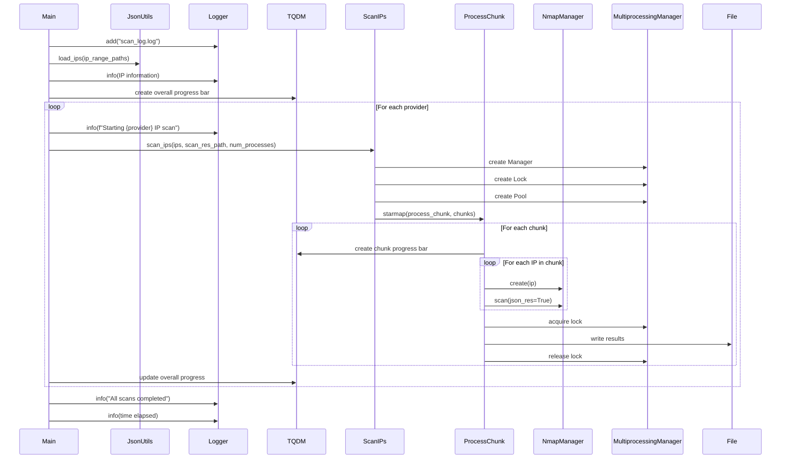

# 主动探测流程介绍


## 1.获取各大VPS厂商的IP范围

正如前面所说的， 我们已经获取了包含各个VPS服务器厂商的IP范围的网站：

## 1. AWS
For aws, it is simple, because the ip range is public.

https://ip-ranges.amazonaws.com/ip-ranges.json


> PS: for the other three I use the (it is a paid web, so I can only
> part of the ips)
> `https://networksdb.io/`
## 2. Tencent Cloud 

https://networksdb.io/ip-addresses-of/tencent-cloud-computing-beijing-co-ltd


## 3. Aliyun

https://networksdb.io/ip-addresses-of/tencent-cloud-computing-beijing-co-ltd


## 4. Huawei Cloud

https://networksdb.io/ip-addresses-of/huawei-cloud


除了第一个可以直接获取外， 后面的都需要编写爬虫来获取，爬虫代码在:

`src/activeprobing/utils/networksdb_scrapy_utils.py`

用于从NetworksDB网站提取各大云服务提供商的IP范围信息。该工具使用Python异步编程实现，能够高效地从多个URL抓取数据。

### 功能特点

- 支持从多个云服务提供商（腾讯云、阿里云、华为云）获取IP范围信息
- 使用异步HTTP请求提高抓取效率
- 解析HTML内容，提取结构化的IP范围数据
- 将抓取的数据保存为JSON格式，便于后续处理和分析

### 代码结构

主要的代码文件是 `src/activeprobing/utils/networksdb_scrapy_utils.py`，其中包含了 `SDBWebScraper` 类，该类负责执行网页抓取、数据解析和结果保存的全过程。

### 使用方法

1. 确保已安装所需的Python库：httpx, asyncio, selectolax, loguru
2. 运行 `networksdb_scrapy_utils.py` 脚本
3. 脚本将自动从预定义的URL列表中抓取数据
4. 抓取的数据将被保存在 `RESOURCES_JSONS_DIR_PATH` 目录下的JSON文件中

### 数据来源

- 腾讯云：https://networksdb.io/ip-addresses-of/tencent-cloud-computing-beijing-co-ltd
- 阿里云：https://networksdb.io/ip-addresses-of/tencent-cloud-computing-beijing-co-ltd
- 华为云：https://networksdb.io/ip-addresses-of/huawei-cloud

注意：AWS的IP范围可以直接从 https://ip-ranges.amazonaws.com/ip-ranges.json 获取，不需要使用此工具。

### 输出格式

每个云服务提供商的数据将被保存为单独的JSON文件，包含以下信息：
- 公司名称
- IP范围
- 网络相关信息
- 相关链接

### 最后得到的结果

```bash
2024-07-10 13:17:02.129 | INFO     | __main__:save_results:86 - 保存了 100 条记录到 C:\Users\23174\Desktop\GitHub Project\ActiveProbing\resources\jsons\tencent_cloud_ips.json
2024-07-10 13:17:02.131 | INFO     | __main__:save_results:86 - 保存了 61 条记录到 C:\Users\23174\Desktop\GitHub Project\ActiveProbing\resources\jsons\aliyun_ips.json
2024-07-10 13:17:02.133 | INFO     | __main__:save_results:86 - 保存了 74 条记录到 C:\Users\23174\Desktop\GitHub Project\ActiveProbing\resources\jsons\huawei_ips.json
```

> 也就是说我们一共获取得到了：
>
> - 100 条腾讯云的IP段落
> - 61 条阿里云的IP段落
> - 74条华为云的IP段落

其中一条数据的例子为:

```json
  {
        "company": "Aliyun Computing Co.LTDALIBABA_CLOUD",
        "CIDR": "43.0.0.0/10",
        "IP Range": "43.0.0.0 - 43.63.255.255",
        "Block size": "4,194,304",
        "links": [
            {
                "text": "All IPs in this network >>",
                "href": "https://networksdb.io/ips-in-network/43.0.0.0/43.63.255.255",
                "class": "link_sm"
            },
            {
                "text": "All domains in this network >>",
                "href": "https://networksdb.io/domains-in-network/43.0.0.0/43.63.255.255",
                "class": "link_sm"
            }
        ]
    }
```


至此，我们已经获取了各个云服务器厂商的IP段落， 为了帮助解析各个云服务器厂商的IP段落， 进行如下的IP的提取:

```python
from pydantic import BaseModel
class VpsIP(BaseModel):
    ip: str
    region: str
    service: str
```


其中解析得到的亚马逊的IP共有`125764529` 个，当然大部分可能是无效IP， 高达8.4G。


下面是其中部分的IP段信息:

```bash
{"ip": "34.251.29.16", "region": "eu-west-1", "service": "EC2"}
{"ip": "34.251.29.17", "region": "eu-west-1", "service": "EC2"}
{"ip": "34.251.29.18", "region": "eu-west-1", "service": "EC2"}
{"ip": "34.251.29.19", "region": "eu-west-1", "service": "EC2"}
{"ip": "34.251.29.20", "region": "eu-west-1", "service": "EC2"}
{"ip": "34.251.29.21", "region": "eu-west-1", "service": "EC2"}
{"ip": "34.251.29.22", "region": "eu-west-1", "service": "EC2"}
{"ip": "34.251.29.23", "region": "eu-west-1", "service": "EC2"}
{"ip": "34.251.29.24", "region": "eu-west-1", "service": "EC2"}
{"ip": "34.251.29.25", "region": "eu-west-1", "service": "EC2"}
{"ip": "34.251.29.26", "region": "eu-west-1", "service": "EC2"}
{"ip": "34.251.29.27", "region": "eu-west-1", "service": "EC2"}
```

由于里面的IP过多， 所以只是随机挑选一些进行扫描测试。

这里我们随机挑选每个IP段落5个IP，然后一共得到`37959`个亚马逊的IP。


- 对于来自SDB的腾讯云，阿里云，和华为云的IP， 里面有一个页面显示了该IP段下进行了DNS解析的IP， 相比没有解析的IP， 解析了DNS域名的IP明显更具有价值， 所以这里我们选取每个IP段落下解析了DNS的IP进行筛选：

  > 比如说其中IP为: `**47.104.8.247:**` : yunxiaotc.com
  >
  > 就是解析到了一共医院的网页:
  >
  > 


但是和之前一样，整个域名列表需要花钱，所以我们只取免费部分即可， 这部分已经够多了


但是这个网页对爬虫的请求速率限制：


所以这里采用代理池(`基于round robin的分流策略`)的方法进行请求即可。

下面是提取到的部分IP：


最后提取到的IP数量如下:

- 阿里云: 38937
- 亚马逊:  37959
- 华为云： 1194
- 腾讯云： 55700



- 腾讯云拥有最大的份额，约占总数的41.7%
- 阿里云和亚马逊AWS的份额相当，分别约占29.2%和28.4%
- 华为云的份额最小，仅占约0.9%

> 课件华为云在这个市场深耕较少，令人意外的是， 阿里云的VPS的IPS数量居然不是中国最多的， 当然也可能是大多数数据都是要付费购买，非付费购买的数据也就这样了。


下面从这些IP中每个都随机抽取100个ip利用`ipinfo.io`来查看其地理位置进行可视化显示:

- 华为


- 阿里云


- 腾讯云


- 亚马逊


> 从上面VPS的IP分布可以看出， 华为云由于VPS的IP较少，抽样部分只分布在`香港`这个地方， 阿里的主要分布在`北京，杭州`等地，因为阿里的base也在这里，也挺符合阿里的公司的性质， 同理腾讯云主要分布在`深圳和北京`也符合腾讯的base的分布， 而亚马逊作为一个国际化的公司，在全球各地都有IP分布，其中`美国华盛顿`分布最多， 在其他地方类似北京，日本，瑞士等地也有分布， 也符合其国际化公司的特点。 那么根据IP位置和公司性质分析，我们所取样的IP是具有实际意义的IP。


## 2. IP主动探测

在`第一步`中，我们已经获取了关于各大VPS厂商中， 具有实际意义的代表的部分VPS的IP， 下一步我们将进行主动探测 ， 主要探测在该IP上主要启动了哪些服务,  这里我们不进行全量端口的扫描，这样太耗时， 借助于`claud3.5`的帮助， 我们决定选取下面的常见服务进行端口扫描：

| 端口      | 可能的服务                         |
| --------- | ---------------------------------- |
| 20        | FTP-DATA (文件传输协议数据)        |
| 21        | FTP (文件传输协议)                 |
| 22        | SSH (安全外壳协议)                 |
| 23        | Telnet (远程登录协议)              |
| 25        | SMTP (简单邮件传输协议)            |
| 53        | DNS (域名系统)                     |
| 80        | HTTP (超文本传输协议)              |
| 110       | POP3 (邮局协议版本3)               |
| 123       | NTP (网络时间协议)                 |
| 143       | IMAP (互联网消息访问协议)          |
| 161       | SNMP (简单网络管理协议)            |
| 389       | LDAP (轻型目录访问协议)            |
| 443       | HTTPS (超文本传输安全协议)         |
| 445       | SMB (服务器消息块)                 |
| 587       | SMTP Submission (邮件提交)         |
| 636       | LDAPS (安全轻型目录访问协议)       |
| 989-990   | FTPS (安全文件传输协议)            |
| 993       | IMAPS (安全IMAP)                   |
| 995       | POP3S (安全POP3)                   |
| 1433      | Microsoft SQL Server               |
| 1521      | Oracle Database                    |
| 1830      | Oracle Database                    |
| 1883      | MQTT (消息队列遥测传输)            |
| 2049      | NFS (网络文件系统)                 |
| 3306      | MySQL Database                     |
| 3389      | RDP (远程桌面协议)                 |
| 3690      | SVN (Subversion版本控制)           |
| 5353      | mDNS (多播DNS)                     |
| 5432-5433 | PostgreSQL Database                |
| 5672      | AMQP (高级消息队列协议)            |
| 5900-5905 | VNC (虚拟网络计算)                 |
| 6379      | Redis (远程字典服务器)             |
| 8000      | 常用于Web服务器或代理              |
| 8080      | 常用于Web服务器或代理              |
| 8443      | 常用于HTTPS的备用端口              |
| 9000      | 常用于Web服务器或应用服务器        |
| 9200      | Elasticsearch                      |
| 9418      | Git (版本控制系统)                 |
| 11211     | Memcached (分布式内存对象缓存系统) |
| 22222     | 常用于SSH的备用端口                |
| 27017     | MongoDB                            |
| 61613     | STOMP (简单文本导向消息协议)       |


其中进行扫描所使用的软件为`nmap` ，扫描的命令为:

```bash
["nmap", "-p", NORMAL_SERVICE_PORTS, "-T4", self.ip],
```

>  也就是指定端口号和ip进行`-T4`级别的快速扫描。

### 代码实现

- UML图



- 时序图



- **IP数据准备**

首先，我们从JSON文件中加载各云服务提供商的IP地址：

```python
aliyun_ips = load_ips(aliyun_ips_range_path)[:idx]
huawei_ips = load_ips(huawei_ips_range_path)[:idx]
amazon_ips = load_ips(amazon_ips_range_path)[:idx]
tencent_cloud_ips = load_ips(tencent_cloud_ips_save_path)[:idx]
```

- **多进程扫描**

为了提高扫描效率，我们使用Python的`multiprocessing`模块实现并行扫描：

```python
def scan_ips(ips: list[Dict[str, str]], output_file: str, num_processes: int = 4):
    chunk_size = max(len(ips) // num_processes, 1)
    chunks = [ips[i : i + chunk_size] for i in range(0, len(ips), chunk_size)]

    with Manager() as manager:
        lock = manager.Lock()
        with Pool(processes=num_processes) as pool:
            pool.starmap(
                process_chunk, [(chunk, output_file, lock) for chunk in chunks]
            )
```

- **单个IP扫描**

对于每个IP，我们使用`NmapManager`类来执行nmap扫描：

```python
def process_chunk(chunk: list[Dict[str, str]], output_file: str, lock: Lock):
    results = []
    for ip in tqdm(chunk, desc="Processing chunk"):
        nmap_manager = NmapManger(ip)
        res = nmap_manager.scan(json_res=True)
        results.append(res)
    
    # 保存结果
    with lock:
        with open(output_file, "a") as f:
            for ip_data in results:
                f.write(json.dumps(ip_data) + "\n")
```

- **结果保存**

扫描结果以JSON格式保存到指定的输出文件。我们使用文件锁来确保多进程写入的安全性。

- **进度监控和日志记录**

我们使用`tqdm`库来显示扫描进度，使用`loguru`库记录详细的扫描信息：

```python
with tqdm(total=len(providers), desc="Overall scanning progress") as pbar:
    for provider, ips, scan_res_path in providers:
        logger.info(f"Starting {provider} IP scan")
        scan_ips(ips, scan_res_path, num_processes=cpu_count())
        pbar.update(1)
        pbar.set_description(f"Completed {provider} scan")
```

- **主函数流程**

在主函数中，我们依次对各个云服务提供商的IP进行扫描：

```python
def main():
    # 加载IP
    # ...

    providers = [
        ("Aliyun", aliyun_ips, aliyun_scan_res_path),
        ("Huawei", huawei_ips, huawei_scan_res_path),
        ("Amazon", amazon_ips, amazon_scan_res_path),
        ("Tencent Cloud", tencent_cloud_ips, tencent_cloud_scan_res_path),
    ]

    # 执行扫描
    # ...

    logger.info("All scans completed")
    time_elapsed = time.time() - start_time
    logger.info(f"Time elapsed: {time_elapsed:.2f} seconds")
```


